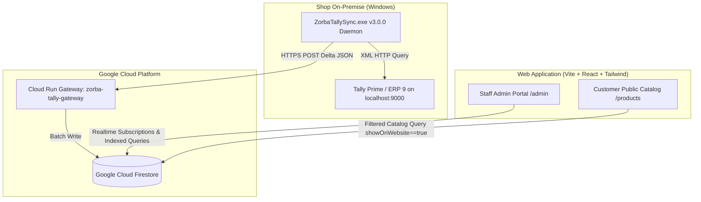

# Zorba Infotech — Web Application & Tally ERP Sync Platform

This repository contains the full-stack web application, admin ERP, and live Tally Prime synchronization engine for **Zorba Infotech** (IT Sales, Computer Hardware, Printer Repairs & Service Center in Neemuch, M.P., India).

- **Production Website:** [https://zorbainfotech.in](https://zorbainfotech.in)
- **Admin Portal:** [https://zorbainfotech.in/admin](https://zorbainfotech.in/admin)
- **Tally Sync Dashboard:** [https://zorbainfotech.in/admin/tally-sync](https://zorbainfotech.in/admin/tally-sync)
- **Cloud Run Gateway:** `https://zorba-tally-gateway-703650129045.asia-south1.run.app`

---

## 🏛️ System Architecture Overview



---

## 🧠 Key Learnings & Agent Context Guide (Crucial for Future Agents)

### 1. Correct Domain Name
* **Always use `https://zorbainfotech.in`** (or `www.zorbainfotech.in`).
* **NEVER** use `zorba.co.in` (legacy placeholder).

### 2. Tally Sync Agent Versioning & Packaging Rules
* **Code Constant (`tools/tally-sync/main.go`):**
  `AppVersion` must always be strict semantic versioning `X.Y.Z` (e.g. `3.0.0`) with **no prefixes** (`v`) and **no suffixes/tags** (`-delta-sync`).
* **Distribution Zip Archives:**
  Must **always** follow the naming pattern: `zorba-website-tally-sync-v<X.Y.Z>.zip` (e.g. `zorba-website-tally-sync-v3.0.0.zip`).
* **Windows Binary Compilation:**
  ```bash
  cd tools/tally-sync
  GOOS=windows GOARCH=amd64 go build -ldflags="-s -w" -o ZorbaTallySync.exe .
  ```

### 3. Customer Ledger Data & Phone Number Extraction
* **Historical Database State:**
  - 12,661 customer accounts were initially migrated from a historical Tally dump (`tally_live_ledgers_dump.json`).
  - In that static dump, only ~32 ledgers had mobile numbers because only `<NAME>` was exported without contact master tags.
* **Live Tally Sync Query (`v3.0.0`):**
  - Queries `NAME, PARENT, GSTIN, INCOMETAXNUMBER, LEDGERPHONE, LEDGERMOBILE, LEDGERCONTACT, EMAIL, ADDRESS, STATENAME, PINCODE, GUID, NARRATION` directly from live Tally XML on `localhost:9000`.
  - Automatically parses Indian 10-digit mobile numbers (`[6-9]\d{9}`), standardizes them with the `91` WhatsApp prefix, and saves them to Firestore.
  - Running `Sync_Customers_Live.bat` on the shop PC will update all customer contact details in Firestore.

### 4. Closing Balance Rules
* **Customer Ledgers:** We do **NOT** track or sync customer account closing balances (monetary debt/credit) from Tally. Customer accounts are strictly imported with demographic/contact data (`name`, `phone`, `city`, `address`, `group`, `gstin`).
* **Stock Items:** For inventory, Tally's `<CLOSINGBALANCE>` represents the physical stock quantity (e.g. `4 Nos`), which maps to `stockCount` in Firestore `products`.

### 5. Smart Delta Hashing & 100% Free Tier Compliance
* **Zero Cost When Unchanged:** The agent hashes product attributes locally using SHA-256 (`tools/tally-sync/.sync_cache.json`). If zero items changed in Tally, zero Firestore writes are executed ($0.00 cloud cost).
* **Cloud Run Gateway:** Configured with `--min-instances 0` to scale down to zero when idle.

---

## 📁 Repository Structure

```
├── src/                          # Frontend React SPA (Vite + TS + Tailwind + Shadcn UI)
│   ├── components/               # UI components (Admin modals, quotation builder, catalog)
│   ├── pages/                    # Route pages (Home, Catalog, Admin, Tally Sync, Customers)
│   ├── lib/                      # Firestore API, Firebase config, dynamic tallyRules engine
│   └── hooks/                    # Custom React hooks (Tally keyboard shortcuts, etc.)
├── services/
│   └── tally-gateway/            # Go Cloud Run service receiving Tally payloads & writing Firestore
│       ├── main.go               # Gateway HTTP handler, normalization, batch processor
│       ├── deploy.sh             # 1-click Cloud Run deployment script
│       └── Dockerfile            # Multi-stage lightweight scratch container
├── tools/
│   └── tally-sync/               # Windows Standalone Sync Client (Go binary + batch runners)
│       ├── main.go               # Tally XML client, delta hasher, daemon runner
│       ├── config.ini            # Tally localhost:9000 & Cloud endpoint configuration
│       ├── *.bat                 # 1-click Windows helper scripts (Dry-run, Live sync, Auto-startup)
│       ├── README.md             # Windows setup instructions (English)
│       └── README_HINDI.md       # Windows setup instructions (Hindi)
├── scripts/                      # Historical migration, audit, and ingestion scripts
└── docs/                         # Architecture roadmaps and optimization specs
```

---

## 🚀 Deployment Commands

### 1. Web Frontend (Firebase Hosting)
```bash
npm run build
firebase deploy --only hosting
```

### 2. Tally Gateway (Google Cloud Run)
```bash
cd services/tally-gateway
bash deploy.sh
```

### 3. Package Windows Sync Engine
```bash
cd tools/tally-sync
GOOS=windows GOARCH=amd64 go build -ldflags="-s -w" -o ZorbaTallySync.exe .
zip -r ../../zorba-website-tally-sync-v3.0.0.zip . -x ".*" -x "*.go" -x "go.mod" -x "go.sum" -x "mock_*" -x "test_*" -x "ZorbaTallySync"
```
