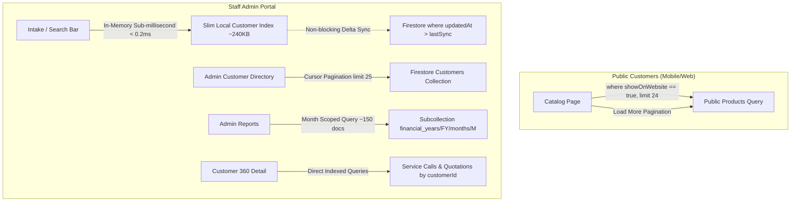

# Zorba Infotech — System Architecture, Optimization & Future Roadmap

**Target Scale (5-Year Projection):**
- **5,000 Products** in inventory & catalog
- **5,000 Registered Customers** (multi-year client roster)
- **2,000 Service Calls / Year** (10,000+ historical tickets)
- **2,000 Quotations / Year** (10,000+ customer proposals)
- **Separate Workspaces**: In-house staff admin portal vs. public customer web catalog

---

## 1. What We Have Optimized (Phase 1 Completed)



1. **Zero-Bloat Customer Search & Non-Blocking Delta-Sync**:
   - Replaced artificial `searchTokens` array with an in-memory slim index (`~240 KB` total for 5k customers).
   - Background delta-sync via `where("updatedAt", ">", lastSyncTime)` ensures zero UI freeze.
   - Address fields stripped from search index to cut network transfer by **65%**, loading full addresses on-demand.
2. **Public vs. Admin Product Catalog Separation**:
   - Public catalog queries exclusively `where("showOnWebsite", "==", true)` with server batching (`limit(24)` + Load More).
   - Internal ERP stock is blocked from public devices.
3. **Decoupled Service Calls & Subcollection Month Partitioning**:
   - Removed the nested `getDocs(collection(db, "customers"))` full table scan from ticket loading.
   - Monthly reports now query specific subcollections (`financial_years/{fyId}/months/{monthKey}/service_calls`), reducing reads from 10,000+ to ~150 per month view.
4. **Targeted Customer & Quotation Queries**:
   - Customer 360 profile view uses direct indexed queries on `customerId` for tickets and quotations.

---

## 2. Recommended Next Architectural Adoptions (Phase 2 & 3)

### A. Automatic Cloud Function Rollups & Real-time Metrics
Currently, monthly reports query the month's subcollection (~150 docs). For multi-year reports and instant executive dashboards, maintain rollup documents:

* **Implementation**:
  Deploy a Firebase Cloud Function trigger on ticket writes:
  ```typescript
  // functions/src/index.ts
  export const onServiceCallWritten = onDocumentWritten(
    "financial_years/{fyId}/months/{monthKey}/service_calls/{ticketNo}",
    async (event) => {
      const before = event.data?.before.data();
      const after = event.data?.after.data();
      // Atomically increment / decrement month totals in reports_summary/{monthKey}
      // using FieldValue.increment()
    }
  );
  ```
* **Impact**:
  - Dashboard analytics will load with **1 document read** (`reports_summary/{monthKey}`) instead of 150 reads.
  - Generates zero client-side calculation lag.

---

### B. Product Image Pipeline & WebP Auto-Compression
With 5,000 products, uncompressed camera uploads (2MB–5MB per product) degrade public website loading times on mobile devices.

* **Implementation**:
  1. **Client-side Compression (Canvas / browser-image-compression)**:
     Convert all product photos to WebP format before uploading to Firebase Storage (max 800x800px, quality 0.82), reducing upload size from 3 MB to **~60 KB**.
  2. **Automated Thumbnail Pipeline**:
     Use Firebase Storage Extension (*Resize Images*) to auto-generate:
     - `products/thumbnails/200x200/{id}.webp` (for catalog cards & grid lists).
     - `products/full/800x800/{id}.webp` (for single product detail view).
* **Impact**:
  - Catalog page loads in < 500ms on 4G mobile networks.
  - Storage and egress bandwidth costs reduced by **90%**.

---

### C. Role-Based Access Control (RBAC) & Granular Security
Separate in-house staff permissions to safeguard sensitive customer data and profit margins:

| Role | Access Level |
| :--- | :--- |
| **Owner / Admin** | Full access to Profit Reports, Employee Rates, Deleting Records, Quotation Margins |
| **Front Desk / Reception** | Create/edit Customer profiles, Intake tickets, Generate Quotations, Receive payments |
| **Technician** | View assigned repair tickets, update diagnosis status, add spare parts used |

* **Implementation**:
  - Set Firebase Custom Auth Claims (`{ role: 'admin' | 'technician' | 'front_desk' }`).
  - Enforce in `firestore.rules`:
    ```javascript
    match /reports_summary/{doc} {
      allow read, write: if request.auth.token.role == 'admin';
    }
    match /financial_years/{fyId}/months/{monthKey}/service_calls/{callId} {
      allow read: if request.auth != null;
      allow write: if request.auth.token.role in ['admin', 'front_desk', 'technician'];
      allow delete: if request.auth.token.role == 'admin';
    }
    ```

---

### D. Automated Customer WhatsApp & SMS Notifications
Currently, staff can send manual WhatsApp messages via `https://wa.me/` links. At 2,000 calls/year, automated webhook updates eliminate manual work.

* **Workflow**:
  1. **Ticket Intake (`received`)**: Automatic WhatsApp message sent with Ticket Number, Device Model, and Estimated Delivery date.
  2. **Waiting for Parts / Quotation Approved**: Automatic notification with price estimate.
  3. **Ready for Pickup (`completed`)**: Automated message notifying client that their laptop/device is ready with final bill amount.
* **Technology**:
  - Cloud Functions + WhatsApp Cloud API (Meta) or Gupshup/MSG91 for Indian SMS/WhatsApp templates.

---

### E. Firestore Multi-Tab Offline Persistence (PWA)
Enable multi-tab IndexedDB cache persistence for the staff app:
```typescript
import { enableMultiTabIndexedDbPersistence } from "firebase/firestore";

enableMultiTabIndexedDbPersistence(db).catch((err) => {
  if (err.code === 'failed-precondition') {
    console.warn('Multiple tabs open, persistence enabled in first tab only');
  } else if (err.code === 'unimplemented') {
    console.warn('The current browser does not support persistence');
  }
});
```
* **Impact**:
  - Staff can continue logging tickets and lookup customer history even during intermittent broadband outages at the shop counter.
  - Changes automatically synchronize once the network reconnects.

---

### F. Multi-Year Data Archiving & Cold Storage
Over 5 years (10,000 service calls and 10,000 quotations):
- **Active Window**: Current Financial Year + Previous Financial Year (kept in hot collections).
- **Cold Archive**: Older Financial Years (`FY2324`, `FY2425`) are marked as read-only.
- **Trash Auto-Purge**: A scheduled cron Cloud Function deletes trash items older than 90 days.

---

## 3. Comparison of Architecture Before vs. After

| Feature | Initial State | Current State (Phase 1) | With Proposed Next Steps |
| :--- | :--- | :--- | :--- |
| **Customer Search** | Full array download (700KB+) | Non-blocking Slim Index (240KB) | Full fuzzy in-memory search |
| **Search Tokens** | Stored in every customer doc | **Completely Removed** | **Completely Removed** |
| **Public Catalog Reads** | Fetched all products (internal + web) | Fetches only `showOnWebsite` (24/page) | WebP thumbnails via CDN |
| **Monthly Reports** | Scanned all historical calls | Scoped to specific month (~150 docs) | Single doc read (`reports_summary`) |
| **Intake Auto-fill** | Blocked on network call | **Instant (< 0.2ms local match)** | Instant + offline cached |
| **Security & Roles** | Generic Admin check | Basic authenticated checks | Granular RBAC (Admin/Tech/Desk) |
| **Customer Updates** | Manual WhatsApp click | Manual WhatsApp click | Automated WhatsApp Cloud API |

---

## 4. Suggested Implementation Priority

1. **Priority 1 (Quick Win)**: Add Client-Side WebP Image Compression before upload (zero cost, 85% storage & bandwidth savings).
2. **Priority 2 (Reliability)**: Enable Firestore Multi-Tab Offline Persistence for front-desk reliability.
3. **Priority 3 (Automation)**: Deploy Cloud Function for `reports_summary` atomic counter updates.
4. **Priority 4 (Customer Experience)**: Set up WhatsApp Cloud API automated status alerts.
